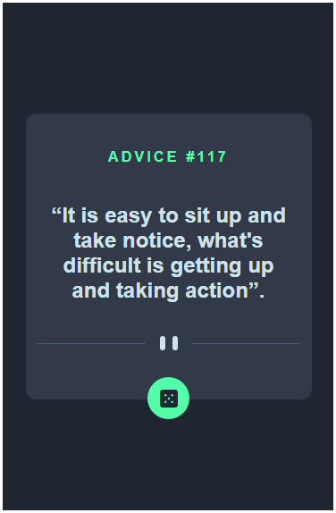
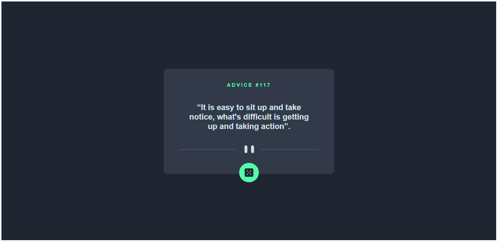

# Frontend Mentor - Advice generator app solution

This is a solution to the [Advice generator app challenge on Frontend Mentor](https://www.frontendmentor.io/challenges/advice-generator-app-QdUG-13db). Frontend Mentor challenges help you improve your coding skills by building realistic projects.

## Table of contents

- [Overview](#overview)
  - [The challenge](#the-challenge)
  - [Screenshot](#screenshot)
- [My process](#my-process)
  - [Built with](#built-with)
  - [Useful resources](#useful-resources)
- [Author](#author)

## Overview

### The challenge

Users should be able to:

- View the optimal layout for the app depending on their device's screen size
- See hover states for all interactive elements on the page
- Generate a new piece of advice by clicking the dice icon

### Screenshot

## My process

### Built with

- Semantic HTML5 markup
- CSS custom properties
- Flexbox
- Mobile-first workflow
- API Fetch

### Useful resources

- [W3Schools CSS Tutorial](https://www.w3schools.com/css/default.asp)
- [W3Schools JavaScript Tutorial](https://www.w3schools.com/js/default.asp)
- [Developer Mozilla](https://developer.mozilla.org/pt-BR/docs/Web/API/Fetch_API/Using_Fetch)

## Author

- Github - [@douglasmardegan](https://github.com/douglasmardegan)
- Frontend Mentor - [@douglasmardegan](https://www.frontendmentor.io/profile/yourusername)

